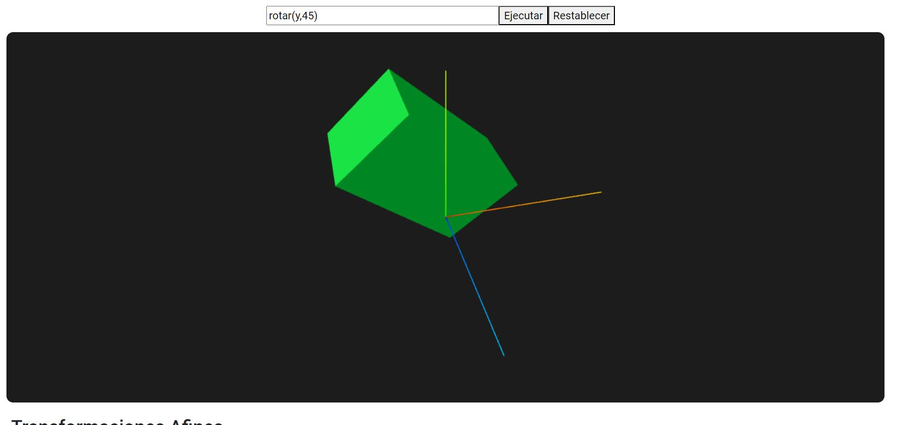

# Computer Graphics Learning Tool 🌐

Computer Graphics Learning Tool is a single-page application (SPA) developed using Angular and Three.js. It provides users with an interactive platform to explore various 3D concepts through predefined commands and real-time interactions across multiple scenes. This application is designed for users to learn and experiment with essential 3D graphics principles.

## Main Features ✨
- 🎮 **Real-time interaction** with each scene using mouse controls or commands.
- 🔄 **Geometrical Transformations** including Translation, Scaling, and Rotation.
- 💡 **Lighting Options**: Create, delete, and modify parameters for various light types, including point, ambient, spotlight, and directional.
- 🖼️ **Textures**: Apply textures, bump mapping, and reflection models to enhance visual realism.
- 🌳 **Scene Graphs**: Organize and manage the components of the scene effectively.
- 🔺 **Triangle Mesh**: Utilize triangle mesh for creating complex geometrical shapes.
- 🛠️ **Free Scene Creation**: Create multiple models and lights, interacting with them using all previous features.

## Technologies Used 🛠️
- **Angular**: Web application framework.
- **Three.js**: JavaScript library for 3D graphics.

## Application Screenshots 📸

Below are previews of the key functionalities of the application, showcasing the user interface design as well.

### Geometrical Transformations
<p align="center">
    
</p>

### Lighting
<p align="center">
    
</p>

### Textures and Bump Mapping
<p align="center">
    
</p>

### Scene Graph
<p align="center">
    
</p>

### Triangle Meshes
<p align="center">
    
</p>

### Free Creative Scene
<p align="center">
    
</p>

## Installation 🚀

Follow these steps to set up the project in your local environment:

1. **Clone the repository**:
   ```bash
   git clone https://github.com/iLuu02/Computer-Graphics-Learning-Tool.git
   cd computer-graphics-learning-tool
   ```

2. **Install the dependencies**:
Make sure you have Node.js and Angular CLI installed. You can find the installation guide [here](https://nodejs.org/en) & [here](https://angular.dev/installation).

Then, navigate to the project folder and run the command to get the necessary dependencies:
```bash
  npm install
```
3. **Run the app**: You can now run the application from a terminal using the command:
```bash
  ng serve
```

Now you can access the application at http://localhost:4200 in your web browser!

